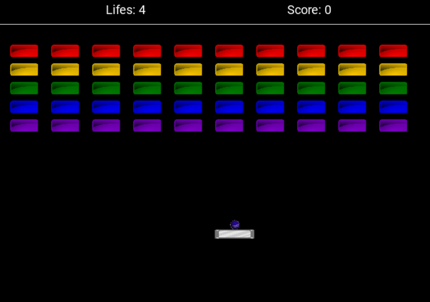
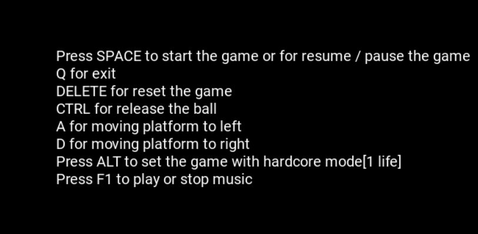
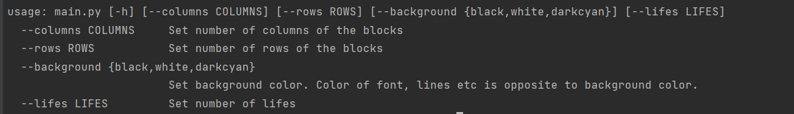
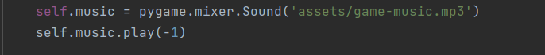

# Arcanoid
This repository contains Python code for the game. It is an arcade game in which the player controls the platform by bouncing the ball off the blocks to clear the level.


<div style="text-align:center;">
    
</div>

## Dependency

Install all dependencies of the project with command ``` pin install -r requirements txt```


## About
This repository contains a Python implementation of the Arkanoid game, featuring customizable level, a movable platform, and destructible blocks. Players can control the platform to bounce the ball and destroy blocks to earn points.

For more information about the original Arkanoid game, you can refer to its [Wikipedia -- Arkanoid](https://en.wikipedia.org/wiki/Arkanoid).

To view the available command-line arguments for running the game, you can execute the following command: `python main.py -h`.

## Controls
- *SPACE* to start the game or for resume / pause the game;
- *Q* for exit;
- *DELETE* for reset the game;
- *CTRL* for release the ball;
- *A* for moving platform to left;
- *D* for moving platform to right;
- *ALT*  to set the game with hardcore mode[1 life];
- *F1* to play or stop music;

<div style="text-align:center;">
    
</div>

## Command-Line Options
When running the game from the command line, you can specify various options to customize These options include:

  - *columns COLUMNS* : Set the number of columns of the blocks;
  - *rows ROWS*: Set the number of rows of the blocks;
  - *background {black, white, darkcyan}*: Set the background color of the game. The color of font, lines, etc., is automatically adjusted to contrast with the background color chosen;
  - *lifes LIFES*: Set any number of lifes you want to start game with

<div style="text-align:center;">
    
</div>

## Project structure
- `README.md`: this file.
- `main.py`: main exutable which start the game
- `game.py`: main game routine.
- `level.py`: create and manage level.
- `entity.py`: module for game objects.
- `helpers.py`: various helpers for other modules.
- `assets_sources.txt`: information about where assets file were gotten.
- `assets`: folder with used assets files.
    + `ball.png`: image of the ball.
    + `platform.png`: image of the platform.
    + `block.png`: image of destroyable blocks.
    + `font.ttf`: font used for rendering text.
    + `game-music.mp3` used for background music.
    + `game-example.png` image of gameplay used in readme
    + `options-1.png` image of available options used in readme
    + `options-2.png` image of available options used in readme


## Documentation

The game itself is well-documented, and you can find documentation for every method in project files. Below showed all main classes of the project


#### Soundtrack
- To change soundtrack you can do it in two ways
  + Find a game_music.mp3 file delete it and paste another music with the same name
  + On the screenshot below you can find in file game code where you can change the name of soundtrack
  + If you want not to play music endless change -1 to 1 on screenshot below



####  Game Class
- The Game class serves as the main application controller. It encapsulates the game's logic, manages game objects.
  + `__init__(edges: Edges, num_of_columns: int, num_of_rows: int, background_color: tuple[int, int, int])`: Initializes the game application object.
  + `run()`: Runs the game application.

#### Level Class
- The Level class encapsulates the logic and management of individual game levels in.
  + ```__init__(lifes: int, blocks: List[Block], platform: Platform, ball: Ball, edges: pygame.Rect, top_start: int)```: Initializes the level object.
  + ```get_top_edge() -> int```: Returns the value of the top of the game area.
  + ```release_ball()```: Releases the ball from the platform. 
  + ```get_game_state() -> GameState```: Returns the game state of the level. 
  + ```get_sprites_group() -> pygame.sprite.Group```:Returns game objects as one group. 
  + ```update()```: Updates the level's state and objects.

#### MovableEntity Class
- The MovableEntity class represents entities within the game that have the ability to move, such as the ball and the platform.
  + ```__init__(image: pygame.Surface, rect: pygame.Rect, speed: Vector2)```: Initializes the movable entity object.
  + ```move()```: Moves the entity.


#### Block Class
- The Block class serves represents the  blocks that the player aims to eliminate.
  + ``` __init__(image: pygame.Surface, rect: pygame.Rect)```: Initializes the block object.
  + ```is_destroyed() -> bool```: Returns whether the block is destroyed or not.
  + ```set_is_destroyed()``` : Marks the block as destroyed.

#### LevelMarker Class 
- The LevelMarker class is responsible for creating and configuring levels within the game environment.
  +   ```__init__(image: pygame.Surface, rect: pygame.Rect)```: Initializes the block object.
  + ```is_destroyed() -> bool```: Returns whether the block is destroyed or not.
  + ```set_is_destroyed()```: Marks the block as destroyed.

#### Platform Class
- The Platform class is needed for representing the platform entity within the game.
  + ``` __init__(image: pygame.Surface, rect: pygame.Rect, speed: Vector2)```: Initializes the platform object.
  + ```move()```: Moves the platform left or right.
  
#### Functions of entity module
- ```adjust_on_x_collision(movable_entity_1: MovableEntity, entity_2: Entity) -> None```: Process collisions on X axis 
between movable entity and other entity and update their positions and speeds.
- ```adjust_on_y_collision(movable_entity: MovableEntity) -> None```: Process collisions on Y axis between movable entity 
and other entity and update their positions and speeds.


## Notes
Images of game objects are resized accordingly to app window resolution. Images
of blocks is colored in rainbow colors, so it is better that the basic block 
image has greyish color.

Also color of text font and top line which delimeters game counters and level
areas (and other similar drawings) is opposite to the background color, thus is
is equal to (in RGB): (255, 255, 255) - "background color value".
